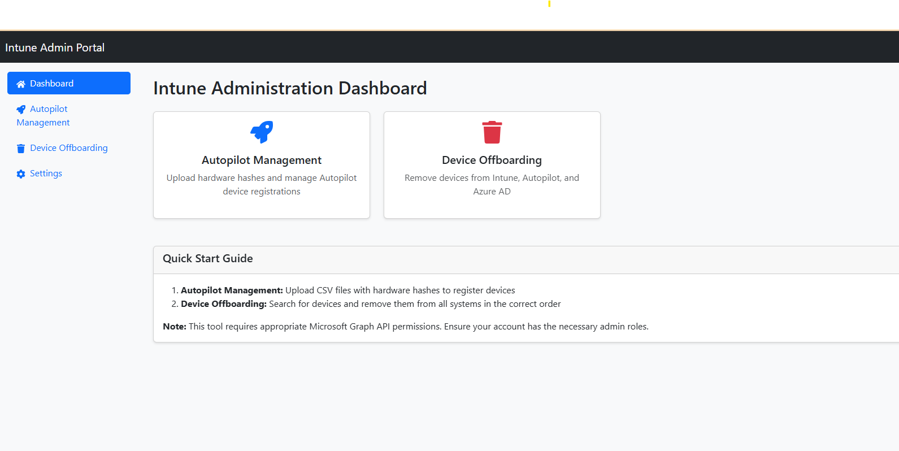
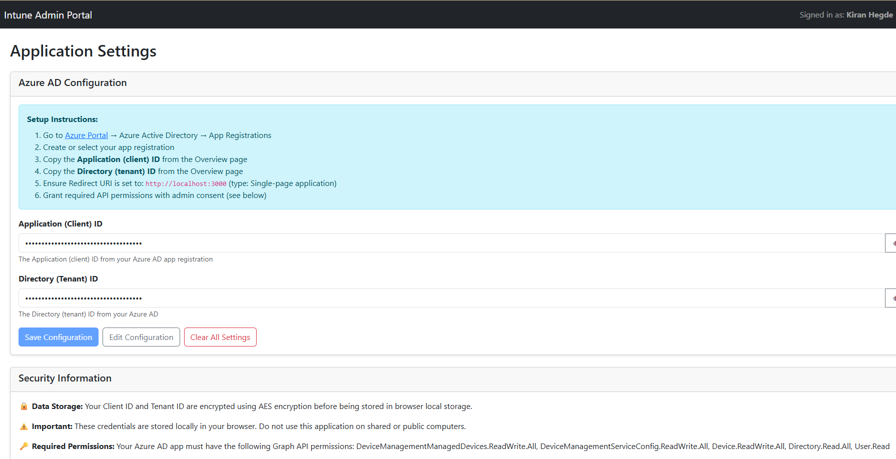
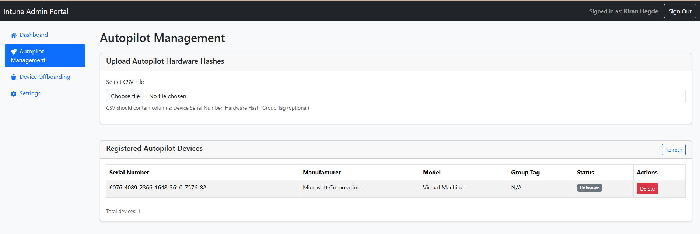
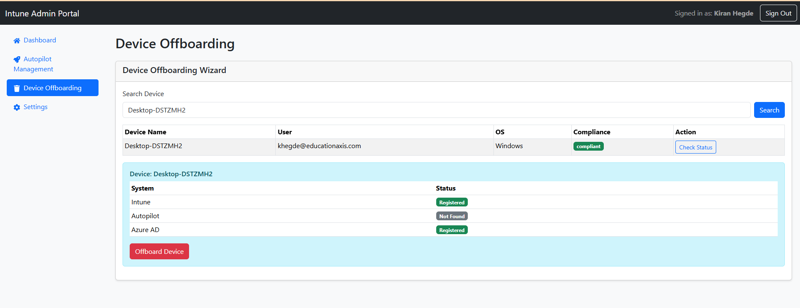

# Intune Admin Web Application

A modern React-based web application for managing Microsoft Intune, Windows Autopilot, and Azure AD devices.



## ✨ Features

- **Autopilot Management**: Upload hardware hashes via CSV and view registered devices with progress tracking
- **Device Offboarding**: Remove devices from Intune, Autopilot, and Azure AD in the correct sequence
- **Software Status**: Monitor application deployment and installation status across devices
- **Secure Configuration**: Encrypted credential storage through in-app Settings page

## 📸 Screenshots

### Settings Page

*Secure configuration with encrypted credential storage*

### Autopilot Management

*Upload hardware hashes and manage Autopilot devices*

### Device Offboarding

*Remove devices from Intune, Autopilot, and Azure AD*

### Software Status

*Monitor application deployment and installation status*

## 📋 Prerequisites

- Node.js 16+ and npm
- Azure AD tenant with admin access
- Azure AD app registration with required Graph API permissions

## 🚀 Quick Start

### 1. Azure AD App Registration

1. Go to [Azure Portal](https://portal.azure.com) → Azure Active Directory → App Registrations
2. Create new registration:
   - Name: Intune Admin Web App
   - Supported accounts: Single tenant
   - Redirect URI: Single-page application - `http://localhost:3000` (or your domain)

3. Grant API permissions (with admin consent):
   - DeviceManagementManagedDevices.ReadWrite.All
   - DeviceManagementServiceConfig.ReadWrite.All
   - Device.ReadWrite.All
   - Directory.Read.All
   - User.Read

### 2. Application Configuration

1. Clone the repository
   ```bash
   git clone https://github.com/YOUR-USERNAME/intune-admin-webapp.git
   cd intune-admin-webapp
   ```

2. Install dependencies
   ```bash
   npm install --legacy-peer-deps
   ```

3. Start the development server
   ```bash
   npm start
   ```

4. Navigate to the Settings page in the application
5. Enter your Azure AD Application (Client) ID and Directory (Tenant) ID
6. Click "Save Configuration" (credentials are encrypted and stored securely in browser)

**Note:** Client ID and Tenant ID are configured through the Settings page and stored encrypted in the browser. Never hardcode these values.